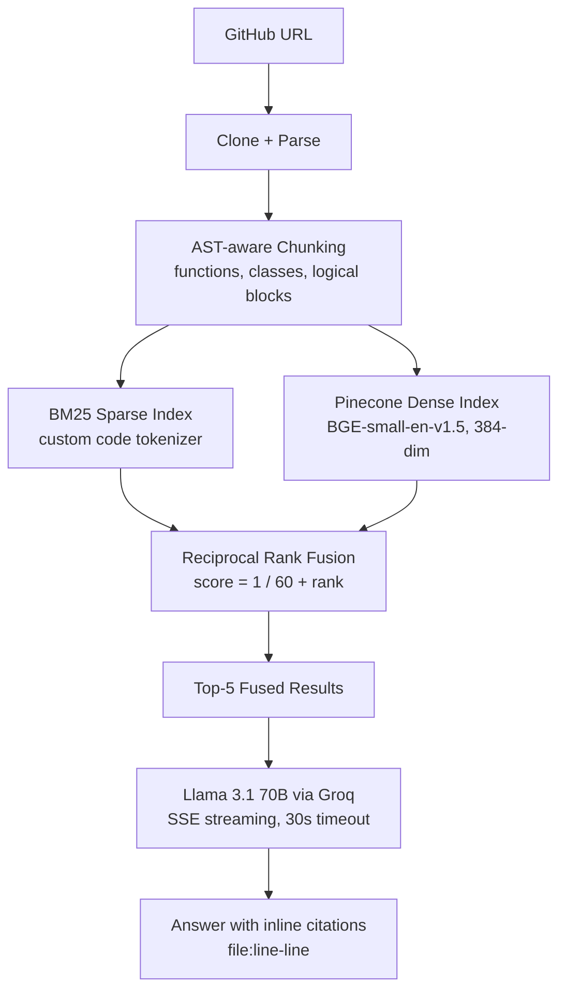

# repo_explainer

Hybrid RAG system that answers natural language questions about any GitHub repository. Paste a URL, it clones, parses, indexes, and returns answers grounded in actual code with file:line citations.

> [!NOTE]
> For an in-depth technical deep-dive into the ingestion pipeline, custom lexers, RRF fusion formulas, and thread-safe DB designs, check out the [System Architecture Manual](docs/architecture.md).

## Architecture



## Why hybrid retrieval

BM25 catches exact token matches — function names, identifiers, code operators — that dense embeddings blur together. Dense search catches semantic similarity when your query wording doesn't match the implementation. Neither is sufficient alone.

Reciprocal Rank Fusion merges both rankings without score normalization. Each result gets `1 / (k + rank)` from each system, summed and sorted. k=60 is the standard; it weights rank 1 heavily while still giving lower ranks a voice. This is the difference between finding `authenticate_user()` when you ask "how does login work" and finding nothing.

## Key decisions

**tree-sitter chunking** — Chunks are functions and classes parsed from the AST, not arbitrary 500-token windows. Falls back to regex when a file doesn't parse. Supports Python, JavaScript, TypeScript, Go, Java, C, C++.

**Custom code tokenizer** — Splits camelCase and snake_case, preserves operators (`==`, `->`, `::`, `&&`), stems with Porter, strips stop words only on the query side (keeps them in the corpus for BM25 IDF calculations).

**SQLite for persistence** — Jobs, chunks, and metadata live in a single SQLite file. No infra dependency for a single-user tool. Pinecone handles the vector side.

**Query router** — Regex-based classification routes metadata questions ("what ORM does this use?", "what database?") to fast structured answers from parsed dependency files. Code questions ("how does auth work?") go through the full RAG pipeline.

**Metadata extraction** — Parses package.json, requirements.txt, pyproject.toml, go.mod, Cargo.toml, pom.xml, Dockerfiles, .env files, and Prisma schemas to detect frameworks, ORMs, databases, auth methods, and package managers. Displayed as structured metadata in the UI.

## Stack

| Layer | Technology |
|---|---|
| Ingestion | GitPython, tree-sitter (7 languages) |
| Sparse retrieval | BM25Okapi with custom code tokenizer |
| Dense retrieval | BGE-small-en-v1.5, Pinecone serverless |
| Fusion | Reciprocal Rank Fusion (k=60) |
| Generation | Llama 3.1 70B via Groq |
| API | FastAPI, BackgroundTasks, SSE |
| Storage | SQLite (jobs, chunks, metadata) |
| Frontend | Vanilla HTML/JS, Tailwind CDN |
| Container | Docker, docker-compose (PostgreSQL dev) |

## Quick start

```bash
cp .env.example .env   # add PINECONE_API_KEY, GROQ_API_KEY, HF_TOKEN
uv sync
./run.sh
```

Open `localhost:8000`, paste a GitHub URL, index, then ask questions.

## API

| Method | Endpoint | Description |
|---|---|---|
| `POST` | `/api/index` | `{ "repo_url": "..." }` → `{ "job_id", "status" }` |
| `GET` | `/api/status/{job_id}` | Poll indexing progress |
| `GET` | `/api/metadata/{job_id}` | Extracted project metadata |
| `POST` | `/api/query` | `{ "question", "job_id?" }` → SSE stream |

Indexing runs as a background task. The status endpoint returns `processing`, `completed`, or `failed` with file/chunk counts.

## Tests

```bash
uv run pytest backend/tests/ -v
```

Covers BM25 tokenization (camelCase, operators, stemming, stop words), RRF fusion (overlap, no overlap, empty), chunking across 5 languages, URL validation, and metadata extraction.

## Tradeoffs

- **SQLite over PostgreSQL** — This is a single-user tool. SQLite is zero-config and fast enough. Docker-compose includes Postgres for development if you want to swap it.
- **Pinecone over local FAISS** — Free tier, production-ready, namespace isolation per repo. FAISS would work but adds operational complexity.
- **BGE-small (384 dim) over larger models** — Latency and cost. BGE-small is fast to encode and the quality difference is marginal for code chunks that already have strong lexical signals.
- **No reranking layer yet** — Retrieval gets top-20 from each system, fuses to top-5. A cross-encoder reranker (Cohere or local) between fusion and generation would improve precision. Planned.

## What's next

- Cross-encoder reranking between fusion and generation
- Incremental re-indexing on repo push
- Multi-repo comparison queries
- Larger context window for bigger codebases
