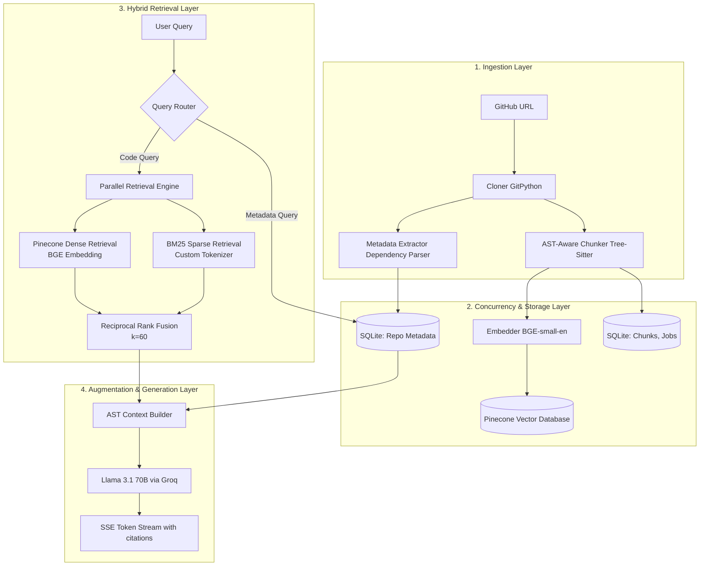

# CodeSage: System Architecture & Technical Specifications

CodeSage is a high-performance, developer-first Hybrid Retrieval-Augmented Generation (RAG) system designed to answer complex, natural language architecture and implementation questions about any GitHub repository. 

This document details the system's architectural layers, algorithmic decisions, design tradeoffs, and thread-safe concurrency model.

---

## System Overview



---

## 1. Ingestion Layer

The ingestion pipeline transforms raw repository code into rich semantic vectors and structured metadata without destroying logic boundaries.

### A. Cloner Component
* **Technology:** `GitPython`
* **Private Repo / Prompt Prevention:** When Git clones a repository, any credential failure or typo triggers an interactive username/password prompt. Inside a headless container/server, this blocks the execution thread forever. CodeSage prevents this by overriding Git's shell environment with `GIT_TERMINAL_PROMPT="0"` and `GIT_ASKPASS="true"`, forcing cloning errors to fail fast, abort cleanly, and update the SQLite job status to `failed` with precise terminal logs.
* **Storage:** Repositories are cloned into a secure local `tempfile.TemporaryDirectory` with prefix `codesage_` which is deleted immediately after AST extraction is complete.

### B. AST-Aware Tree-Sitter Chunker
Traditional text chunking (e.g., using a fixed-length window of 500 characters) tears functions, classes, and logic blocks in half, destroying their semantic meaning and syntactic integrity. CodeSage utilizes the Abstract Syntax Tree (AST) to extract logical nodes.
* **Technology:** Native `tree-sitter` bindings for 7 target programming languages: Python, JavaScript, TypeScript, Go, Java, C, and C++. Heuristic regex falls back for markdown, text, and other unsupported file formats.
* **Logic-Aware Boundaries:** 
  * Rather than splitting on arbitrary tokens, the parser navigates the tree to isolate specific syntactical nodes (e.g., `FunctionDefinition`, `ClassDefinition`, `MethodDeclaration`).
  * If a function node is too small (e.g., a simple getter), it is automatically coalesced with neighboring nodes to ensure adequate semantic density.
  * If a node exceeds the maximum token length, it is sliced along semantic block boundaries (like loop branches or conditionals) rather than mid-statement.
* **Chunk Enrichment:** Every generated chunk is prepended with contextual header metadata:
  ```
  chunk_type: function
  File: backend/app/auth.py
  Language: python

  def authenticate_user(username, password):
      ...
  ```
  This guarantees that when embeddings or BM25 match the chunk, the LLM maintains a strong awareness of the chunk's scope, language, and file context.

### C. Automated Metadata Extraction
In parallel with AST chunking, CodeSage scans the workspace for configuration, dependency, and setup manifests to build a structured profile of the repository.
* **Scanned Manifests:** `package.json`, `requirements.txt`, `pyproject.toml`, `go.mod`, `Cargo.toml`, `pom.xml`, `Dockerfile`, `docker-compose.yml`, `.env`, `prisma/schema.prisma`, and `settings.py`.
* **Identified Primitives:**
  * **Frameworks:** FastAPI, Django, Express.js, Gin, Spring Boot, React, Next.js.
  * **ORMs:** SQLAlchemy, Prisma, Hibernate, GORM, Django ORM.
  * **Databases:** PostgreSQL, MySQL, SQLite, MongoDB, Redis, Cassandra.
  * **Auth Methods:** JWT, OAuth2, Auth0, Passport.js, Firebase Auth.
  * **Package Managers:** npm, yarn, pnpm, pip, poetry, uv, maven, cargo.

---

## 2. Hybrid Retrieval Layer

CodeSage implements a dual-stream search pipeline combining the lexical accuracy of Sparse BM25 with the semantic understanding of Dense Embeddings.

```
Query: "How do we hash passwords?"
 │
 ├──► Sparse Stream (BM25)  ──► Matches: [hash, password, bcrypt] ────┐
 │                                                                     ├─► Reciprocal Rank Fusion ─► Context
 └──► Dense Stream (Embeds) ──► Matches: "encrypt", "security", "salt" ┘
```

### A. Sparse Stream: Custom Code Tokenizer
Standard natural language tokenizers (like NLTK's word tokenizer) strip punctuation and group code characters together in ways that render code search useless. CodeSage uses a customized lexical tokenizer:
* **Identifier Splitting:** Splits variables on CamelCase and snake_case (e.g., `authenticateUser` $\rightarrow$ `["authenticate", "User"]`) to match natural queries.
* **Operator Preservation:** Retains critical code symbols that represent relational context (`==`, `->`, `::`, `&&`, `||`, `!=`) while discarding structural symbols like brackets and commas.
* **Stop Word Heuristics:** Standard stop words (like `for`, `while`, `if`, `in`) are preserved in the corpus index because they define code logic and control flow, but are stripped from the user query if they are purely linguistic filler.
* **Stemming:** Applies Porter Stemming to code keywords to group variations (e.g., `indexing`, `indexed`, `indexer` $\rightarrow$ `index`).

### B. Dense Stream: Semantic Vector Space
While BM25 excels at catching exact variable names or functions, it misses conceptual matches (e.g., searching for "login" when the code only uses "authentication").
* **Embedding Model:** `BAAI/bge-small-en-v1.5` (384 dimensions). This model is highly efficient, has an extremely small footprint, and registers microsecond inference latencies on CPU cores.
* **Pinecone Integration:** Code Sage uploads chunks to Pinecone serverless vector databases.
* **Namespace Isolation:** To prevent data leaks and cross-repository pollution, each indexed repository is isolated into its own dedicated Pinecone namespace using its unique `job_id`.

### C. Reciprocal Rank Fusion (RRF)
Merging raw scores from BM25 (arbitrary positive values) and Cosine Similarity (normalized between -1 and 1) is mathematically invalid and leads to poor retrieval balance. 
CodeSage utilizes **Reciprocal Rank Fusion (RRF)**, which relies purely on the relative *rank* of results rather than their scores.

For a document $d$, its RRF score is computed as:
$$RRF(d) = \sum_{m \in M} \frac{1}{k + r_m(d)}$$

Where:
* $M$ is the set of retrievers (BM25 and Dense).
* $r_m(d)$ is the rank index of document $d$ inside retriever $m$ (1-indexed).
* $k$ is a constant ($k = 60$), which prevents low-ranked items from disproportionately skewing the score, while heavily weighting documents that rank #1 or #2 in either engine.

The top 5 fused results are chosen as the context windows.

---

## 3. Augmentation & Generation Layer

### A. Context-Aware Query Routing
Before launching the heavy hybrid search, CodeSage uses a fast query router to classify queries.
* **Metadata Route:** Questions like *"What database does this use?"* or *"What package manager do I need?"* bypass BM25 and Pinecone entirely. They are resolved instantly using the SQLite metadata table.
* **Code Route:** Semantic queries are routed to the parallel BM25 and Pinecone pipelines.

### B. Prompts & Inline Citations
The context builder structures the top 5 chunks along with the parsed repository metadata:
```
You are an expert developer explaining the codebase.
Refer to the following repository metadata:
- Languages: ...
- Frameworks: ...

Use the following highly relevant code chunks to answer.
You MUST cite the source file and line numbers inline (e.g., `[auth.py:45-56]`).

Code Chunks:
...
```

### C. LLM & Streaming Inference
* **Inference Engine:** Llama 3.1 70B hosted on Groq, delivering extremely low latency (often exceeding 100 tokens/sec).
* **Streaming Protocol:** Standard HTTP Server-Sent Events (SSE). Tokens are pushed to the frontend in real-time as they are generated by the model.

---

## 4. Thread-Safe Concurrency & SQLite Storage

CodeSage processes indexing in the background so users don't face gateway timeouts while a large repository is being cloned and parsed. Because the API runs asynchronously in FastAPI (using threadpools for synchronous operations), database concurrency is a critical design requirement.

### A. The Shared Connection Anti-Pattern (Resolved)
Initially, the database used a single global shared connection (`_conn`). Under multi-threaded usage:
* The background indexing thread would commit chunks while the main thread polled `/api/status/{job_id}`.
* This caused thread conflicts, silent database crashes, database locking errors, and left tasks permanently frozen at `"Cloning repository..."`.

### B. Thread-Safe Connection Pooling Heuristics
To resolve this, CodeSage implements a thread-safe connection-on-demand acquisition pipeline in `backend/app/storage.py`:

```
                    ┌────────────────────────┐
                    │  FastAPI Async Thread  │
                    └───────────┬────────────┘
                                │ _get_conn()
                                ▼
                    ┌────────────────────────┐
                    │ sqlite3.connect()      │ ──► timeout=30.0
                    └───────────┬────────────┘
                                │ executescript()
                                ▼
                    ┌────────────────────────┐
                    │ CREATE TABLE IF EXISTS │ ──► Microsecond schema check
                    └───────────┬────────────┘
                                │ 
                                ▼
                    ┌────────────────────────┐
                    │   execute() / commit() │ ──► Isolated transaction
                    └───────────┬────────────┘
                                │ finally
                                ▼
                    ┌────────────────────────┐
                    │      conn.close()      │ ──► File descriptor released
                    └────────────────────────┘
```

1. **Short-Lived Connections:** Every database operation opens a new connection, executes its query within a transactional context, and closes it immediately.
2. **Strict try-finally cleanup:** Every database call utilizes a `try-finally` block to ensure that database file descriptors are never left dangling, even if a query throws an error.
3. **On-Demand Schema Initialization:** Table schema check (`CREATE TABLE IF NOT EXISTS`) is performed inside `_get_conn()` dynamically. In SQLite, this is a microsecond-level catalog check. This ensures that:
   * Production runs remain highly concurrent and stable.
   * Unit tests that mock database paths dynamically (`test.db` in `/tmp/...`) automatically initialize their tables on the first query without requiring separate setup scripts.

---

## 5. Architectural Tradeoffs & Technical Decisions

* **SQLite over Postgres (Production default):** CodeSage is designed to be a lightweight, zero-dependency utility. Adding a requirement for a running PostgreSQL server adds heavy operational complexity for developers. SQLite performs all status checks and text storage instantly and runs directly from a local file.
* **BGE-small over Large Embeddings:** Code chunks already have high lexical uniqueness (function names, structural parameters, APIs). A 384-dimensional model captures the semantic contours perfectly while keeping container size, RAM footprint, and inference latency to an absolute minimum.
* **Pinecone over FAISS:** While FAISS would allow local vector search, it would require storing, updating, and writing vector indexes to disk inside the local container for every repository. Pinecone Serverless removes this heavy state management, offers instant search speeds on its free tier, and provides seamless namespace isolation.
