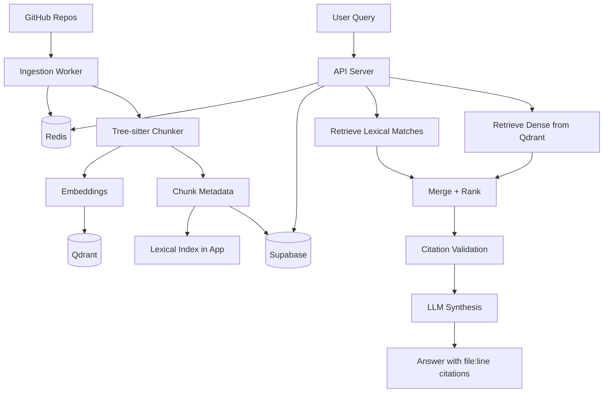

# Lean MVP Architecture

## Goal

Build a credible first version of the cross-repo code question-answering system without locking into heavy infrastructure too early.

The MVP should prove four things:

- AST-aware code chunking works better than fixed token chunking.
- Hybrid retrieval is necessary for exact symbols and semantic questions.
- Answers can be returned with verifiable file:line citations.
- The system can index multiple repositories and answer cross-repo questions at useful quality.

This document intentionally optimizes for learning speed and correctness over maximum scale.

---

## Recommendation

Use this stack for the lean MVP:

- `TypeScript` for the API, workers, and query orchestration.
- `Supabase` for users, sessions, repo registry, job records, eval data, and answer audit history.
- `Redis` for caching, background jobs, webhook deduplication, and short-lived query state.
- `Qdrant` for dense vector retrieval.
- A light lexical retrieval layer implemented in the app first, then upgraded only if evals prove it is needed.

This is not overengineering because each component has a distinct job:

- `Supabase` handles relational application data well.
- `Redis` handles operational state and fast ephemeral data well.
- `Qdrant` handles vector search well.
- `TypeScript` keeps the application stack cohesive.

What the MVP should not do yet:

- no graph database on day one
- no dedicated BM25 service on day one
- no complex multi-node agent framework before baseline retrieval is measured
- no aggressive performance engineering for 10k QPS before real usage exists

---

## Lean Architecture

---

## Core Components

### 1. API and Workers

Use `TypeScript` for:

- indexing endpoints
- query endpoints
- webhook endpoints
- background ingestion workers
- answer assembly and citation validation

Good runtime choices:

- `Next.js` route handlers if you want a single app surface
- `NestJS` if you want stronger service structure
- `Express` or `Fastify` if you want the smallest backend surface

For the MVP, `Fastify` or `Next.js` is enough.

### 2. Supabase

Use `Supabase` for application records, not primary retrieval.

Store:

- users
- sessions
- repositories
- indexing jobs
- chunk records and anchors
- eval questions
- eval labels
- answer history
- citation audit logs

Suggested tables:

- `users`
- `repos`
- `index_jobs`
- `chunks`
- `questions`
- `answers`
- `citations`
- `eval_sets`
- `eval_results`

The `chunks` table should include at least:

- `repo_id`
- `path`
- `start_line`
- `end_line`
- `symbol`
- `language`
- `body`
- `summary`
- `content_hash`
- `vector_id`

### 3. Redis

Use `Redis` for operational workloads:

- indexing queue
- embedding queue
- summarization queue
- caching repeated queries
- deduping GitHub webhook deliveries
- storing short-lived partial answer handles
- rate limiting

This is a strong fit and not overengineering. Without it, async indexing and repeated query handling become awkward quickly.

### 4. Qdrant

Use `Qdrant` as the dense retrieval engine.

Store for each point:

- `repo`
- `path`
- `start_line`
- `end_line`
- `symbol`
- `language`
- `summary`
- `body`

Why it fits the MVP:

- simple mental model
- strong filtering support
- straightforward upsert/delete behavior
- easier to scale later than trying to force dense retrieval into the relational store

### 5. Lexical Retrieval

For the MVP, keep this simple.

Options in order:

1. start with a lightweight in-app BM25 or lexical scorer
2. or use Postgres full-text search for quick iteration
3. only introduce Tantivy or OpenSearch after evals show exact-symbol recall is weak

This is the main place to avoid premature complexity.

### 6. LLM Layer

Use a single synthesis model first.

MVP responsibilities:

- answer only from retrieved context
- cite every claim using `repo/path:start-end`
- decline unsupported claims

Do not start with a complicated agent graph unless the query flow actually branches in meaningful ways.

For the MVP, a simple pipeline is enough:

1. retrieve dense results
2. retrieve lexical results
3. merge and trim
4. validate anchors exist
5. synthesize answer with mandatory citations

---

## Query Flow

### Retrieval Flow

1. Receive the user question.
2. Generate one dense query embedding.
3. Search `Qdrant` for top dense matches.
4. Search the lexical layer for exact symbol and path matches.
5. Merge results with a simple weighted fusion or RRF.
6. Keep only chunks whose anchors exist in `Supabase`.
7. Build the synthesis prompt with repo/path/line metadata.
8. Generate the answer.
9. Parse citations from the answer.
10. Reject or repair any claim whose anchor is not in the indexed chunk set.

### Why This Is Lean

It solves the hard correctness problem early:

- AST-aware chunking
- hybrid retrieval
- citation verification

It postpones the expensive complexity:

- graph traversal
- dedicated reranking service
- symbol-diff incremental indexing
- distributed high-QPS tuning

---

## Ingestion Flow

1. Register a repo in `Supabase`.
2. Queue an ingestion job in `Redis`.
3. Clone the repo in a worker.
4. Read the license before indexing.
5. Parse files with `tree-sitter`.
6. Chunk on function and class boundaries.
7. Generate one-sentence summaries for chunks.
8. Write chunk metadata to `Supabase`.
9. Write embeddings to `Qdrant`.
10. Build or refresh the lexical index.
11. Mark the job complete.

Even in the MVP, keep these two rules:

- never index without checking the license
- never answer with anchors that do not exist in the stored chunk records

---

## What To Measure In The MVP

Before adding more infrastructure, measure these:

- exact symbol recall on 20 to 30 real questions
- cross-repo answer usefulness on 10 to 15 real questions
- citation validity rate
- median and p95 query latency
- time to index one repo and a small changed commit

If the MVP already performs well enough on these, do not add more moving parts yet.

---

## What Would Be Overengineering Right Now

These are reasonable later, but too early for the first version unless the project must satisfy the full rubric immediately:

- `Kuzu` graph database from day one
- `Tantivy` or `OpenSearch` before lexical recall is measured
- a full `LangGraph` workflow before branching logic is real
- incremental symbol-level diffing before basic reindex cost is known
- weekly drift alerts before there is a stable eval set
- performance work aimed at 10k QPS before user traffic exists

---

## Phase Plan After The MVP

### Phase 1: Lean MVP

Build only what is needed to prove correctness.

- `TypeScript` API and worker service
- `Supabase` for users, jobs, chunks, eval records
- `Redis` for queues and cache
- `Qdrant` for vectors
- `tree-sitter` AST chunking
- dense plus lexical retrieval
- mandatory citation validation
- small manual eval set

Exit criteria:

- can answer multi-repo questions with citations
- can verify anchors before returning the answer
- can show clear improvement over dense-only retrieval on exact symbol queries

### Phase 2: Retrieval Quality Upgrade

Add only the pieces that fix measured retrieval misses.

- add a stronger lexical engine if exact-symbol recall is weak
- add a reranker if top results are noisy
- add better chunk summaries if semantic matches are weak
- add repo/path/symbol weighting in retrieval fusion

Exit criteria:

- improved MRR@10 and nDCG@10 on the held-out set
- better exact symbol recall without major latency regression

### Phase 3: Cross-Repo Reasoning Upgrade

Add structure when cross-repo resolution becomes the main failure mode.

- add symbol relationship extraction
- add a graph layer such as `Kuzu`
- connect imports, calls, inheritance, and definitions across repos
- use graph expansion only when retrieval confidence is low

Exit criteria:

- cross-repo symbol questions stop failing due to disconnected definitions
- citations remain verifiable after graph expansion

### Phase 4: Incremental Indexing

Optimize ingest only after the system is already useful.

- add Git push webhooks
- add content hashing per chunk
- re-embed only changed chunks
- refresh lexical index incrementally
- measure searchable time after small and medium commits

Exit criteria:

- changed commits become searchable fast enough for the actual workflow
- reindexing cost drops materially versus full rebuilds

### Phase 5: Production Hardening

Add scale and observability once the system has proven value.

- prompt caching
- eval automation
- weekly drift runs
- latency SLOs and timeout fallback
- richer answer UI with snippet previews and follow-ups
- tracing and dashboards

Exit criteria:

- stable evaluation trend over time
- acceptable p95 latency
- clear operational visibility into failures and regressions

---

## Final Recommendation

If the decision is whether `Supabase + Redis + TypeScript` is good or overengineered, the answer is:

- good as the application backbone
- not enough alone as the entire retrieval backbone
- not overengineered when paired with a dedicated vector store

The lean MVP should be:

- `TypeScript`
- `Supabase`
- `Redis`
- `Qdrant`
- AST-aware chunking
- simple hybrid retrieval
- strict citation validation

Then add graph, stronger lexical retrieval, reranking, and incremental indexing only when the evals show a concrete need.
